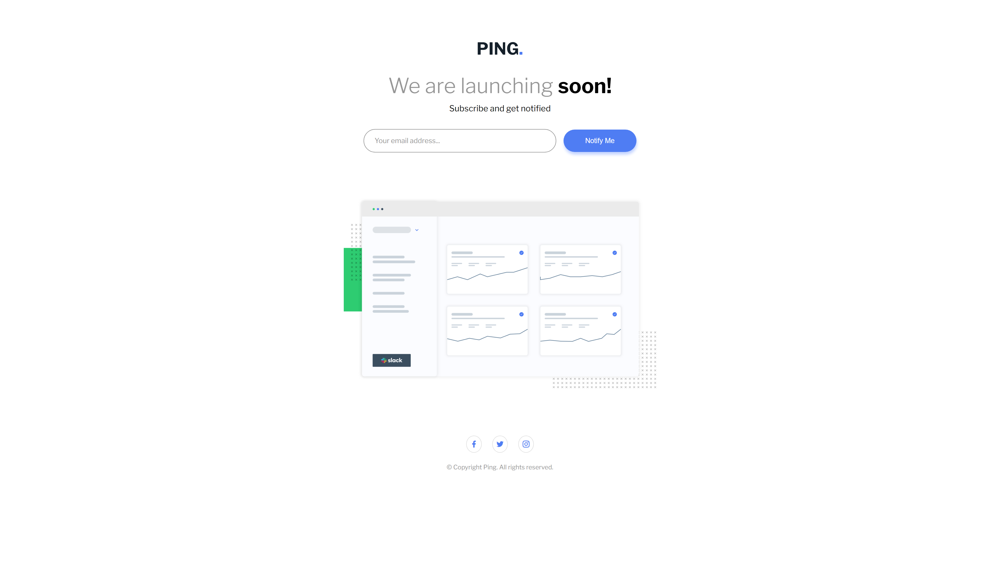
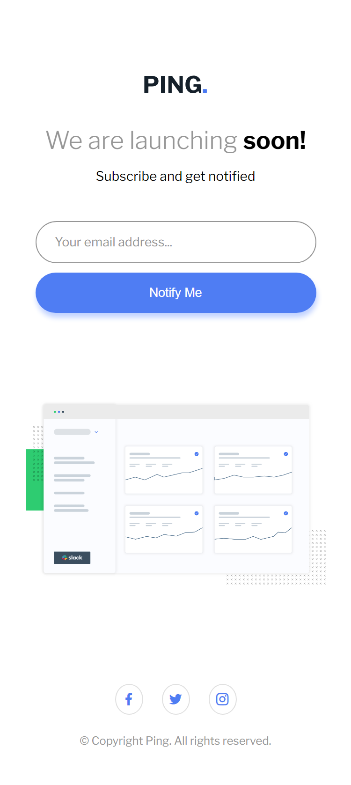

# Frontend Mentor - Ping coming soon page solution

This is a solution to the [Ping coming soon page challenge on Frontend Mentor](https://www.frontendmentor.io/challenges/ping-single-column-coming-soon-page-5cadd051fec04111f7b848da). Frontend Mentor challenges help you improve your coding skills by building realistic projects. 

# Frontend Mentor - Base Apparel coming soon page solution

This is a solution to the [Base Apparel coming soon page challenge on Frontend Mentor](https://www.frontendmentor.io/challenges/base-apparel-coming-soon-page-5d46b47f8db8a7063f9331a0). Frontend Mentor challenges help you improve your coding skills by building realistic projects. 

## Overview

### Screenshot

## Desktop

## Mobile

### Links

- Solution URL: [Github](https://github.com/Affan840/Ping-Single-Column-Coming-Soon-Page)
- Live Site URL: [Live Preview](https://affan840.github.io/Ping-Single-Column-Coming-Soon-Page/)

### Built with

- Semantic HTML5 markup
- CSS custom properties
- Flexbox

## Author

- Instagram - [@muhammad__affan07](https://www.instagram.com/muhammad__affan07/)
